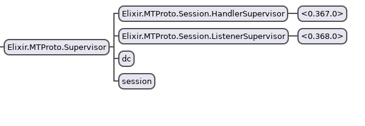

# Telegram MT(Proto)

The aim of this project is to implement
[MTProto](https://core.telegram.org/mtproto) (Telegram) in elixir.
**Expect things to break** since it's still in alpha.
You may also want to take a look at
[this example](https://github.com/Fnux/telegram-client-elixir-demo).

Oh, and it's my fisrt *real* elixir project so it's probably awful.

This library is on [hex.pm](https://hex.pm/packages/telegram_mt),
the documentation is available [here](https://hexdocs.pm/telegram_mt/MTProto.html).

## Status & Roadmap

Version `v0.0.1-alpha` has been released ([changelog](changelog.md)).

**Status (in short) :** you currently can receive and send message, fetch
contacts.

**Roadmap for `v0.0.2-alpha` :**

* [ ] "Populate" most of the API modules
(See the [available method list](https://core.telegram.org/methods))
  * [ ] Working with authorizations (import/import)
  * [x] Working with messages
  * [x] Working with contacts
  * [x] Help module
  * ...
* [ ] Handling different data centers

## How it work ?

I originally created this project in order to create bridges between Telegram and
other services (IRC, Matrix, ... ?). Hence, it must be able to handle multiple
users at the same time.

 *Observer - 1 session*.

Each session has one listener and one handler (they are registered in the
`:session` registry). The `:dc` registry saves the data related to each specific DC
(Telegram uses 5 DCs) such as the address or the authorization key.

## Example

```
» iex -S mix

Interactive Elixir (1.4.0) - press Ctrl+C to exit (type h() ENTER for help)
iex> {:ok, session_id} = MTProto.connect(4) # Connect to DC 4
{:ok, 0000000000000000000}

19:10:07.231 [info]  The authorization key was successfully generated.

iex> MTProto.send_code(session_id, "0041000000000")
No client for 0000000000000000000, printing to console.
{0000000000000000000,
 %{name: "rpc_result", req_msg_id: 0000000000000000000,
   result: %{is_password: %{name: "boolFalse"}, name: "auth.sentCode",
     phone_code_hash: "000000000000000000",
     phone_registered: %{name: "boolTrue"}, send_call_timeout: 120}}}

iex> MTProto.sign_in(session_id, "0041000000000", "00000")
No client for 0000000000000000000, printing to console.
{0000000000000000000,
 %{name: "rpc_result", req_msg_id: 0000000000000000000,
   result: %{expires: 0000000000, name: "auth.authorization",
     user: %{first_name: "XXXX", id: 000000000, inactive: %{name: "boolFalse"},
       last_name: "", name: "userSelf", phone: "41000000000",
       photo: %{name: "userProfilePhoto",
         photo_big: %{dc_id: 4, local_id: 00000, name: "fileLocation",
           secret: 0000000000000000000, volume_id: 000000000},
         photo_id: 000000000000000000,
         photo_small: %{dc_id: 4, local_id: 00000, name: "fileLocation",
           secret: 0000000000000000000, volume_id: 000000000}},
       status: %{name: "userStatusOffline", was_online: 0000000000},
       username: "xxxxxxx"}}}}
```
